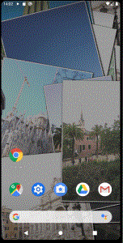

# Album Live Rebuild

スマホ内の画像が折り重なるように次々に表示されるAndroid用のライブ壁紙です。

## Description

- Android用のライブ壁紙です。
- 画像を折り重なるように表示します。
- 指定のフォルダ内の画像からランダムに更新します。

## Requirement

- Android 8.0以上

## Usage

- 設定 - 外観 - 壁紙 - ライブ壁紙 から *Album Live Rebuild* を選択してください。
- 初めて使う場合は設定画面からフォルダパスを指定する必要があります。
- フォルダに画像を配置(コピー)するのは別のアプリで行ってください。

## Install

- [Google Play Store で公開](https://play.google.com/store/apps/details?id=tech.takumisoft.albumliverebuild)

## Privacy Policy

- [Privacy Policy について](PrivacyPolicy.md)
